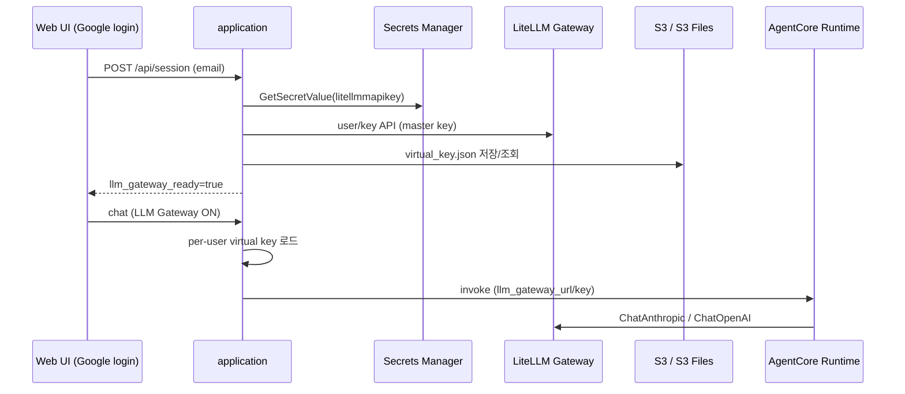

# LiteLLM / LLM Gateway Provisioning

`agentic-work`에서 LiteLLM Proxy(LLM Gateway)를 쓰는 방식, Master Key·Virtual Key 발급, 저장소, 런타임 연동을 정리합니다.

Gateway 인프라 자체(ECS/ALB/RDS)는 별도 저장소 [`litellm-guide`](https://github.com/kyopark2014/litellm-guide)로 배포합니다. 이 문서는 **agentic-work 애플리케이션·런타임 쪽 연동**에 초점을 둡니다.

---

## 1. 개요

| 항목 | 내용 |
|------|------|
| Gateway URL | `config.json`의 `llm_gateway_url` (예: `https://gateway.my-agentic-ai.click`) |
| Master Key | Secrets Manager `litellmmapikey` → `{"litellm_master_key":"sk-…"}` |
| Virtual Key | 이메일 `user_id`별 발급, `enterprise` 팀 · `internal_user_viewer` · `all-proxy-models` |
| Virtual Key 저장 | ECS: `/mnt/app-data/litellm/virtual_key.json` · 로컬+S3: S3만 사용 |
| 추론 경로 | Web UI → Application → AgentCore Runtime → LiteLLM (Gateway ON 시) |



---

## 2. 관련 파일

| 경로 | 역할 |
|------|------|
| [`installer.py`](./installer.py) `create_secrets()` | `litellmmapikey` Secrets Manager 등록 (이미 있으면 skip) |
| [`uninstaller.py`](./uninstaller.py) | 공유 secret 삭제 목록에 `litellmmapikey` 포함 |
| [`application/litellm_virtual_key.py`](./application/litellm_virtual_key.py) | Virtual Key 조회·발급·저장 |
| [`application/app_data_backend.py`](./application/app_data_backend.py) | mount / S3 / local 백엔드 선택 |
| [`application/api/routes_auth.py`](./application/api/routes_auth.py) | 로그인 시 Virtual Key 프로비저닝 |
| [`application/runtime_mode.py`](./application/runtime_mode.py) | chat 시 Gateway 자동 ON + 유저 키 주입 |
| [`application/api/routes_config.py`](./application/api/routes_config.py) | Gateway URL/키 설정·`/v1/models` 검증 |
| [`application/llm_gateway_models.py`](./application/llm_gateway_models.py) | UI 모델명 ↔ LiteLLM `model_name` |
| [`application/web/src/components/LlmGatewayModal.tsx`](./application/web/src/components/LlmGatewayModal.tsx) | 사이드바 LLM Gateway UI |
| [`runtime_agent/langgraph/chat.py`](./runtime_agent/langgraph/chat.py) | Runtime에서 Gateway 클라이언트로 추론 |
| [`runtime_agent/langgraph/llm_gateway_models.py`](./runtime_agent/langgraph/llm_gateway_models.py) | Runtime용 동일 모델 맵 |
| [`error_of_litellm.md`](./error_of_litellm.md) | Gateway Failed 요청 분석 메모 |

---

## 3. Master Key (Secrets Manager)

### 3.1 Secret 스펙

| 항목 | 값 |
|------|-----|
| Secret name | `litellmmapikey` (프로젝트 비종속, account/region 공유) |
| SecretString | `{"litellm_master_key":"<sk-…>"}` |
| Region | installer 기본 `us-west-2` |

### 3.2 설치 시 등록

`installer.py` → `create_secrets()`:

1. `describe_secret(litellmmapikey)` — **이미 있으면 skip** (재입력·덮어쓰기 없음)
2. 없으면 프롬프트로 Master Key 입력 후 `create_secret`
3. Tavily(`tavilyapikey`) / Notion(`notionapikey`)과 동일 패턴

수동 등록 예:

```bash
aws secretsmanager create-secret \
  --name litellmmapikey \
  --region us-west-2 \
  --description "shared secret for LiteLLM master key (reusable across projects)" \
  --secret-string '{"litellm_master_key":"sk-..."}'
```

이미 있을 때 값만 갱신:

```bash
aws secretsmanager put-secret-value \
  --secret-id litellmmapikey \
  --region us-west-2 \
  --secret-string '{"litellm_master_key":"sk-..."}'
```

### 3.3 사용처

- Application만 Master Key를 사용합니다 (Virtual Key 발급 API).
- AgentCore Runtime에는 **유저 Virtual Key**(또는 fallback용 config 키)만 전달합니다. Runtime IAM에 `litellmmapikey`를 넣을 필요는 없습니다.
- ECS Task Role은 `secretsmanager:GetSecretValue` on `*` 이므로 Application에서 secret 읽기가 가능합니다.

### 3.4 Uninstall

`uninstaller.py` 공유 secret 삭제 확인 시 `tavilyapikey` / `notionapikey` / `litellmmapikey`를 함께 안내합니다. 기본값은 **삭제하지 않음** (`yes`일 때만 삭제).

---

## 4. Virtual Key 프로비저닝

구현: [`application/litellm_virtual_key.py`](./application/litellm_virtual_key.py)

### 4.1 트리거

| 시점 | 동작 |
|------|------|
| Google / local 로그인 (`POST /api/session`) | email이면 `ensure_virtual_key_on_login()` |
| Session GET | 캐시에 키 있으면 `llm_gateway_ready=true` |
| Chat (`runtime_mode.run_agent`) | 캐시 miss + email이면 재해결 시도 |

이메일 판별: `^[^@\s]+@[^@\s]+\.[^@\s]+$`  
email이 아니면 Virtual Key 로직을 건너뜁니다.

### 4.2 발급 정책

| 항목 | 값 |
|------|-----|
| Team | `enterprise` (`/team/list`에서 `team_alias` 매칭) |
| User role | `internal_user_viewer` (UI viewer) |
| Models | `["all-proxy-models"]` (프록시 등록 모델 전체) |
| Limits | `max_budget` / `tpm_limit` / `rpm_limit` = `null` (제한 없음) |
| key_alias | 기본적으로 email (충돌 시 `agentic-work:{email}`) |

### 4.3 처리 흐름

1. 저장소에서 `user_id`(email) 키 조회 → 있으면 재사용
2. 없으면 Secrets Manager에서 Master Key 로드 + `llm_gateway_url` 사용
3. LiteLLM에 사용자 조회 (`/user/list?user_email=…`)
4. 없으면 `/user/new` (viewer, auto_create_key=false)
5. `/team/member_add` → `enterprise` (이미 멤버면 Unique constraint 무시)
6. `/key/generate` → plaintext `sk-…` 수신
7. 저장소에 기록

**중요:** LiteLLM은 생성 직후를 제외하고 Virtual Key 평문을 다시 내려주지 않습니다.  
저장소에 없고 Gateway에만 키가 있어도, Application은 **로컬/S3 캐시용으로 새 키를 한 장 더 발급**합니다. (`/key/regenerate`는 Enterprise 라이선스 기능이라 사용하지 않음)

### 4.4 저장소 (`virtual_key.json`)

JSON 예:

```json
{
  "user@example.com": {
    "key": "sk-…",
    "user_id": "user@example.com",
    "team_id": "e1b6b8e7-…",
    "team_alias": "enterprise"
  }
}
```

| 환경 | 위치 |
|------|------|
| ECS (`/mnt/app-data` 마운트) | `/mnt/app-data/litellm/virtual_key.json` |
| 로컬 + `config.json`의 `s3_bucket` | **S3만** — `s3://{bucket}/app-data/litellm/virtual_key.json` (로컬 파일 생성 안 함, 메모리 캐시) |
| 로컬 + 버킷 없음 / `APP_DATA_S3_DISABLE=1` | `application/data/litellm/virtual_key.json` |

S3 prefix는 ECS app-data FS와 동일하게 `app-data/` 입니다 (`app_data_backend.S3_FILES_PREFIX`).

서버 기동 시 (`application/server.py` lifespan) `restore_virtual_key_store()`로 스토어를 로드합니다.

---

## 5. LLM Gateway 활성화

### 5.1 자동 ON (Virtual Key 있을 때)

[`application/runtime_mode.py`](./application/runtime_mode.py):

1. `get_cached_virtual_key(user_id)` (필요 시 resolve)
2. 키가 있으면 → `llm_gateway_enabled=True`, `llm_gateway_key=유저키`
3. 없거나 실패 → **기존 동작**: task 토글 + `config.json`의 `llm_gateway_key`
4. URL/키가 비면 Bedrock으로 fallback

### 5.2 Web UI

- 로그인 응답 `llm_gateway_ready`
- 새 태스크 / 활성 태스크의 `llm_gateway_enabled`를 자동으로 true로 맞춤
- 사이드바 **LLM Gateway** 모달: URL·키 검증 (`GET {url}/v1/models`), 성공 시 config 저장

### 5.3 AgentCore payload

Application → Runtime:

```json
{
  "llm_gateway_enabled": true,
  "llm_gateway_url": "https://gateway.my-agentic-ai.click",
  "llm_gateway_key": "sk-… (per-user virtual key)"
}
```

Runtime [`chat.py`](./runtime_agent/langgraph/chat.py):

- Claude → `ChatAnthropic` (`base_url` = gateway URL)
- OpenAI → `ChatOpenAI` (`base_url` = `{gateway}/v1`)

---

## 6. Config

`application/config.json` / `runtime_agent/langgraph/config.json` (installer가 preserve):

| 키 | 설명 |
|----|------|
| `llm_gateway_url` | Gateway base URL |
| `llm_gateway_key` | Fallback 공유 키 (Virtual Key 없을 때 / 수동 Gateway ON) |
| `s3_bucket` | 로컬에서 Virtual Key·tasks.db S3 동기화에 사용 |

UI에서 Gateway 설정을 저장하면 application + runtime `config.json`을 함께 갱신합니다 (`routes_config._save_llm_gateway`).

---

## 7. 모델 매핑

[`application/llm_gateway_models.py`](./application/llm_gateway_models.py)  
(런타임 복사본: `runtime_agent/langgraph/llm_gateway_models.py`)

| UI 표시명 | LiteLLM `model_name` |
|-----------|----------------------|
| Claude 5.0 Sonnet | `claude-sonnet-5` |
| Claude 5.0 Opus | `claude-opus-5` |
| Claude 4.6 Sonnet | `claude-sonnet-4-6` |
| Claude 4.5 Sonnet | `claude-sonnet-4-5` |
| Claude Fable 5 | `claude-fable-5` |
| Claude 4.8 Opus | `claude-opus-4-8` |
| Claude 4.7 Opus | `claude-opus-4-7` |
| Claude 4.6 Opus | `claude-opus-4-6` |
| Claude 4.5 Opus | `claude-opus-4-5` |
| Claude 4.5 Haiku | `claude-haiku-4-5` |
| OpenAI GPT 5.5 | `gpt-5.5` |
| OpenAI GPT 5.4 | `gpt-5.4` |
| OpenAI GPT 5.6 Sol | `gpt-5.6-sol` |
| OpenAI GPT 5.6 Terra | `gpt-5.6-terra` |
| OpenAI GPT 5.6 Luna | `gpt-5.6-luna` |

맵에 없는 모델은 Gateway ON이어도 Bedrock으로 폴백합니다.  
Gateway에 실제로 등록된 id는 Admin UI 또는:

```bash
curl -sS "$LITELLM_URL/v1/models" -H "Authorization: Bearer $LITELLM_MASTER_KEY"
```

모델 등록 스크립트는 `litellm-guide/install/models.py` / `register_models.py`를 참고하세요.

---

## 8. 환경 변수

| 변수 | 용도 |
|------|------|
| `APP_DATA_S3_BUCKET` | `config.json`의 `s3_bucket` 대신 강제 지정 |
| `APP_DATA_S3_DISABLE=1` | 로컬에서 S3 동기화 끄기 (오프라인) |
| `APP_DATA_DIR` | 로컬 working 디렉터리 (tasks.db 등; Virtual Key S3 모드에서는 키 파일 미사용) |
| `TASK_DB_MOUNT` / `APP_DATA_MOUNT` | 기본 `/mnt/app-data` |
| `ALLOW_LOCAL_AUTH_BYPASS` | 로컬 로그인 (email이 아니면 Virtual Key 스킵) |

---

## 9. 운영 체크리스트

### 최초 설정

1. `litellm-guide`로 Gateway 배포 → Admin UI에서 `enterprise` 팀·모델 확인
2. `installer.py` 실행 시 Master Key 입력 **또는** Secrets Manager에 `litellmmapikey` 수동 등록
3. `application/config.json`에 `llm_gateway_url` (및 필요 시 fallback `llm_gateway_key`) 설정
4. ECS/Application 배포 후 Google 로그인 → `llm_gateway_ready` / 사이드바 Gateway On 확인

### 확인 명령

```bash
# Master Key secret
aws secretsmanager get-secret-value \
  --secret-id litellmmapikey --region us-west-2 \
  --query SecretString --output text

# Virtual key store (S3)
aws s3 cp \
  "s3://$BUCKET/app-data/litellm/virtual_key.json" -

# Gateway health
curl -sS "$LITELLM_URL/v1/models" -H "Authorization: Bearer $MASTER_OR_VIRTUAL_KEY"
```

### 트러블슈팅

| 증상 | 확인 |
|------|------|
| 로그인 후 Gateway Off | email `user_id`인지, Master Key/URL, `enterprise` 팀 존재 여부 |
| 401 from Gateway | Virtual Key / Master Key 만료·오타, 팀 모델 권한 |
| 모델 폴백 to Bedrock | `LLM_GATEWAY_MODEL_MAP`에 UI 이름 있는지, Gateway `/v1/models`에 id 있는지 |
| 로컬이 예전 키를 씀 | S3 모드인지 확인; `application/data/litellm/` 로컬 파일은 무시됨 |
| Failed 비율 높음 | [`error_of_litellm.md`](./error_of_litellm.md) (Mantle schema, Virtual Key 형식 등) |

---

## 10. 보안 메모

- **Master Key**는 Admin·프로비저닝 전용. 클라이언트·AgentCore payload에 넣지 않습니다.
- 사용자에게는 **Virtual Key**만 사용합니다 (spend·권한 분리).
- `virtual_key.json`과 `config.json`의 `llm_gateway_key`는 비밀값입니다. git에 커밋하지 마세요 (`application/.gitignore`의 `data/`, `config.json`).
- LiteLLM Admin UI 비밀번호는 보통 Master Key와 동일합니다 (`litellm-guide` 기준).

---

## 11. 참고

- LiteLLM Virtual Keys: https://docs.litellm.ai/docs/proxy/virtual_keys
- LiteLLM RBAC / `internal_user_viewer`: https://docs.litellm.ai/docs/proxy/access_control
- Gateway 배포·팀/예산 API 예제: [`litellm-guide/README.md`](../litellm-guide/README.md)
- agentic-work Failed 분석: [`error_of_litellm.md`](./error_of_litellm.md)


# LiteLLM

LiteLLM에서 OIDC와 연동하여 Key 발급이 가능합니다. 다만 **기능 범위에 따라 오픈소스와 엔터프라이즈로 나뉩니다.** 아래에 상세히 정리해 드릴게요. 😊

---

## 🔐 LiteLLM OIDC 연동 Key 발급 


### 1️⃣ JWT/OIDC → `/key/generate` 엔드포인트 직접 호출 (오픈소스 가능)

OIDC JWT 토큰을 **Bearer 토큰**으로 사용해 직접 `key/generate`를 호출하는 방식입니다.

```bash
curl --location '{proxy_base_url}/key/generate' \
  --header 'Authorization: Bearer <OIDC_JWT_TOKEN>' \
  --header 'Content-Type: application/json' \
  --data '{}'
```

**설정 방법 (config.yaml)**

```yaml
general_settings:
  master_key: sk-1234
  enable_jwt_auth: True

litellm_jwtauth:
  admin_jwt_scope: "litellm-proxy-admin"     # 어드민 권한 scope
  JWT_PUBLIC_KEY_URL: "https://{idp}/.well-known/openid-configuration"
```

**환경변수**

```bash
export JWT_PUBLIC_KEY_URL="https://your-idp.com/.well-known/openid-configuration"
```

---

### 2️⃣ JWT → Virtual Key 자동 매핑 (🔒 Enterprise 기능)

JWT 토큰의 **claim 값(예: email, sub, client_id 등)을 기존 Virtual Key에 자동 매핑**하는 방식입니다. 개발자가 SSO 로그인 후 별도로 API 키를 배포받지 않아도 됩니다.

**동작 흐름**

```
개발자 SSO 로그인 → OIDC JWT 발급 → LiteLLM Proxy에 요청
→ JWT Claim으로 Virtual Key 자동 조회/매핑 → 모델 호출
```

**설정 예시**

```yaml
litellm_jwtauth:
  virtual_key_claim_field: "email"       # 매핑에 사용할 JWT claim
  unregistered_jwt_client_behavior: "auto_register"  # 미등록 사용자 자동 등록
```

**매핑 등록 API**

```bash
curl -X POST {proxy_url}/jwt/key/info \
  -H "Authorization: Bearer sk-admin" \
  -d '{
    "jwt_claim_name": "email",
    "jwt_claim_value": "user@example.com",
    "key": "sk-virtual-key-from-key-generate"
  }'
```

---

### 3️⃣ SDK에서 OIDC 자동 인증 (오픈소스 가능)

Python SDK를 통해 **Azure AD, Okta, Keycloak 등 OAuth2/OIDC 프로바이더와 자동 토큰 갱신** 연동도 됩니다.

```python
import litellm
from litellm.proxy_auth import AzureADCredential, ProxyAuthHandler

litellm.use_litellm_proxy = True
litellm.proxy_auth = ProxyAuthHandler(
    credential=AzureADCredential(),
    scope="api://my-litellm-proxy/.default"
)

response = litellm.completion(
    model="gpt-4o",
    messages=[{"role": "user", "content": "Hello!"}]
)
```

---

### 📋 지원 OIDC 프로바이더 정리

| 프로바이더 | 지원 여부 |
|---|---|
| Azure AD / AKS | ✅ |
| Google Cloud Run | ✅ |
| GitHub Actions | ✅ |
| CircleCI v1/v2 | ✅ |
| Okta, Keycloak, Auth0 | ✅ (SDK proxy_auth) |
| Kubernetes ServiceAccount | ✅ (EKS, GKE, AKS) |

---

### ⚠️ 오픈소스 vs 엔터프라이즈 비교

| 기능 | 오픈소스 | 엔터프라이즈 |
|---|:---:|:---:|
| JWT로 `/key/generate` 호출 | ✅ | ✅ |
| JWT → Virtual Key 자동 매핑 | ❌ | ✅ |
| 그룹 기반 자동 토큰 발급 | ❌ | ✅ |
| RBAC (역할 기반 접근) | 제한적 | ✅ |
| 사용자별 spend/rate 제한 | ❌ | ✅ |

---

### 🔑 핵심 요약

> **"OIDC로 JWT를 발급받아 `Authorization: Bearer` 헤더로 `/key/generate`를 호출하는 것은 오픈소스에서도 가능합니다.**
> 단, JWT Claim으로 Virtual Key를 **자동 매핑/관리**하는 엔터프라이즈급 기능은 LiteLLM Enterprise 라이선스가 필요합니다."


## 🔑 IdP (Identity Provider) 란?

**IdP**는 **Identity Provider(신원 제공자)** 의 약자로, 쉽게 말하면 **"당신이 누구인지 증명해주는 서비스"** 입니다!

---

### 🏪 일상적인 비유로 이해하기

> 인터넷 쇼핑몰에서 **"카카오로 로그인"** 또는 **"구글로 로그인"** 버튼을 눌러본 적 있으시죠?
>
> 이때 **카카오, 구글이 바로 IdP** 역할을 합니다!
> - 쇼핑몰은 직접 비밀번호를 관리하지 않고
> - 카카오/구글에게 **"이 사람이 진짜 맞아?"** 를 물어보는 거예요

---

### 🔄 동작 흐름

```
사용자       →    내 앱/서비스    →     IdP (카카오, 구글 등)
  |                   |                      |
로그인 요청  →  "IdP에게 물어봐"  →  신원 확인 후 토큰 발급
                       ↑                      |
                  토큰 받아서     ←────────────┘
                  사용자 인증 완료!
```

---

### 🏢 대표적인 IdP 종류

| 구분 | 서비스 |
|---|---|
| **소셜 로그인** | Google, Kakao, Naver, Apple, GitHub |
| **기업용** | Microsoft Azure AD, Okta, Keycloak, Auth0 |
| **클라우드** | AWS Cognito, AWS IAM |
| **오픈소스** | Keycloak, Authentik, Dex |

---

### 🔐 IdP와 OIDC의 관계

> 경수님이 이전에 질문하셨던 **OIDC(OpenID Connect)** 가 바로 **IdP와 앱이 대화하는 표준 프로토콜**이에요!

```
IdP  ←──(OIDC 프로토콜)──→  LiteLLM Proxy
 |
 └── JWT 토큰 발급
      └── 사용자 신원 정보 포함
           └── LiteLLM이 이걸 보고 Key 발급 여부 결정!
```

| 용어 | 역할 |
|---|---|
| **IdP** | 신원을 확인하고 토큰을 발급하는 **서비스** |
| **OIDC** | IdP와 앱이 소통하는 **표준 규칙(프로토콜)** |
| **JWT** | IdP가 발급하는 **신원 증명서(토큰)** |

---

### 💡 LiteLLM에서의 실제 흐름 예시

예를 들어 **AWS Cognito를 IdP로 사용**한다면:

```
개발자 로그인
    ↓
AWS Cognito (IdP) 에서 신원 확인
    ↓
JWT 토큰 발급 (내 이메일, 역할 등 포함)
    ↓
LiteLLM Proxy에 JWT 토큰으로 요청
    ↓
LiteLLM이 JWT 검증 → API Key 발급! 🎉
```

---

한마디로 **IdP = 인터넷 세계의 주민등록사무소** 라고 생각하시면 됩니다! 😄


경수님, 상세하게 정리해 드릴게요! 😊

---

## 🔐 LiteLLM JWT 검증 + API Key 발급 설정 방법

### ⚠️ 먼저 결론부터: 유료인가요?

> **네, JWT 기반 인증(enable_jwt_auth)은 LiteLLM Enterprise 기능입니다.**

| 플랜 | 가격 | JWT Auth 포함 여부 |
|---|---|---|
| **오픈소스** | 무료 | ❌ |
| **Enterprise Basic** | 약 $250/월 | ✅ |
| **Enterprise Premium** | 약 $30,000/년 ($2,500/월) | ✅ |
| **Free Trial** | 무료 (30일) | ✅ 문의 시 제공 |

> 💡 단, **마스터키로 직접 `/key/generate`** 호출하는 것은 오픈소스에서도 가능합니다!

---

## 🛠️ 설정 방법 (Enterprise 기준 전체 흐름)

### 📌 전체 아키텍처

```
사용자
  ↓ SSO 로그인 (Keycloak / Okta / Azure AD 등)
IdP → JWT 토큰 발급
  ↓ JWT를 Bearer 토큰으로 LiteLLM에 전달
LiteLLM Proxy
  ↓ JWT 서명 검증 (공개키로 검증)
  ↓ Claim 확인 (role, email, sub 등)
  ↓ Virtual Key 자동 발급 or 매핑
모델 호출 허용 🎉
```

---

### Step 1. `config.yaml` 설정

```yaml
general_settings:
  master_key: sk-1234
  enable_jwt_auth: True          # ✅ JWT 인증 활성화

litellm_jwtauth:
  # 🔑 어드민 scope 설정
  admin_jwt_scope: "litellm-proxy-admin"

  # 👤 JWT Claim → LiteLLM 사용자/팀 매핑
  user_id_jwt_field: "sub"         # JWT의 sub → 사용자 ID
  user_email_jwt_field: "email"    # JWT의 email → 사용자 이메일
  team_ids_jwt_field: "groups"     # JWT의 groups → 팀 ID

  # 🔑 Virtual Key 자동 발급 설정
  virtual_key_claim_field: "email"              # 매핑 기준 Claim
  unregistered_jwt_client_behavior: "auto_register"  # 미등록 사용자 자동 등록

  # ✉️ 특정 이메일 도메인만 허용
  user_allowed_email_domain: "your-company.com"
  user_id_upsert: true             # DB에 없으면 자동 insert
```

---

### Step 2. 환경변수 설정

```bash
# IdP의 OIDC 공개키 URL (JWT 서명 검증에 사용)
export JWT_PUBLIC_KEY_URL="https://your-idp.com/.well-known/openid-configuration"

# JWT audience 검증 (선택사항)
export JWT_AUDIENCE="api://LiteLLM_Proxy"
```

---

### Step 3. IdP별 공개키 URL 예시

| IdP | JWT_PUBLIC_KEY_URL |
|---|---|
| **Keycloak** | `https://keycloak.example.com/realms/{realm}/.well-known/openid-configuration` |
| **Azure AD** | `https://login.microsoftonline.com/{tenant-id}/v2.0/.well-known/openid-configuration` |
| **Okta** | `https://your-org.okta.com/.well-known/openid-configuration` |
| **AWS Cognito** | `https://cognito-idp.{region}.amazonaws.com/{user-pool-id}/.well-known/openid-configuration` |
| **Google** | `https://accounts.google.com/.well-known/openid-configuration` |

---

### Step 4. JWT로 API Key 발급 요청

```bash
# 1️⃣ IdP에서 JWT 토큰 획득 후
JWT_TOKEN="eyJhbGci..."

# 2️⃣ JWT Bearer 토큰으로 Key 발급 요청
curl --location 'http://localhost:4000/key/generate' \
  --header "Authorization: Bearer $JWT_TOKEN" \
  --header 'Content-Type: application/json' \
  --data '{
    "models": ["gpt-4o", "claude-3-5-sonnet"],
    "duration": "30d",
    "metadata": {"team": "backend"}
  }'
```

---

### Step 5. auto_register 동작 방식

`unregistered_jwt_client_behavior: "auto_register"` 설정 시:

```
처음 JWT로 요청
    ↓
LiteLLM이 JWT 검증 ✅
    ↓
DB에 사용자 없음 확인
    ↓
자동으로 Virtual Key 생성 + DB 저장
    ↓
이후 동일 JWT claim 으로 요청 시 → 기존 Key 재사용 🔄
```

---

## 💰 비용 없이 쓸 수 있는 대안

경수님이 AWS에 계시니, **오픈소스 범위 안에서도 비슷한 효과**를 낼 수 있는 방법이 있어요!

| 방법 | 비용 | 설명 |
|---|---|---|
| **AWS Cognito + Lambda Authorizer** | 거의 무료 | Cognito JWT 검증 후 LiteLLM master key로 key 발급 |
| **마스터키 직접 사용** | 무료 | JWT 대신 master_key로 `/key/generate` 호출 |
| **Free Trial 신청** | 30일 무료 | LiteLLM 공식 문의로 Enterprise trial 신청 |

---

## 📝 한줄 요약

> **JWT 검증 + 자동 Key 발급은 Enterprise 기능 ($250/월)** 이지만,
> **30일 무료 트라이얼**이 있고, AWS 코리아 입장에서는 고객사에게 소개할 때 **Cognito + LiteLLM 조합**으로 오픈소스 범위 내 구현도 가능합니다! 😊


## 🔍 실제 동작 방식

JWT 토큰 안에는 이미 사용자 정보가 **암호화되어 포함**되어 있습니다.

### JWT 토큰 구조 (실제 내부)

```
eyJhbGciOiJSUzI1NiJ9  ← Header (알고리즘 정보)
.
eyJzdWIiOiIxMjM0NTY3ODkwIiwiZW1haWwiOiJ1c2VyQGNvbXBhbnkuY29tIiwicm9sZXMiOlsidXNlciJdfQ==
.                       ← Payload (사용자 정보 포함!)
SflKxwRJSMeKKF2QT4fwpMeJf36POk6yJV...  ← Signature (위조 방지 서명)
```

JWT Payload를 디코딩하면 이런 내용이 들어있어요:

```json
{
  "sub": "user-12345",
  "email": "user@company.com",   // 👈 이미 이메일이 토큰 안에!
  "name": "홍길동",
  "roles": ["user"],
  "groups": ["team-backend"],
  "exp": 1735689600             // 만료시간
}
```

---

## 🔄 실제 인증 흐름

```
1️⃣ 사용자가 IdP(Okta/Azure AD 등)에 로그인
         ↓ (ID/PW 또는 SSO)
2️⃣ IdP가 JWT 토큰 발급
   → 토큰 안에 email, sub, roles 등이 이미 포함됨
         ↓
3️⃣ 사용자가 JWT를 LiteLLM에 전달
         ↓
4️⃣ LiteLLM이 JWT 서명(Signature)을 IdP 공개키로 검증
   → "이 토큰이 진짜 IdP가 발급한 게 맞아?"
         ↓
5️⃣ 서명 검증 OK → 토큰 안의 email 값을 꺼내서 사용
   → 이메일로 어떤 연락도 하지 않음! ✅
```

---

## 📬 이메일 관련 설정의 실제 의미

LiteLLM config에서 `email` 관련 설정은 이런 의미합니다.

```yaml
litellm_jwtauth:
  user_email_jwt_field: "email"
  # ☝️ "JWT 토큰 안의 'email' 필드를 사용자 식별자로 쓰겠다"는 의미
  # 이메일을 보내거나 확인하는 게 아님!

  user_allowed_email_domain: "company.com"
  # ☝️ "company.com 도메인 이메일을 가진 사람만 접근 허용"
  # 도메인 필터링 역할! 이메일 발송 아님!
```

---

## 🆚 혼동하기 쉬운 인증 방식 비교

| 방식 | 설명 | 이메일 발송? |
|---|---|---|
| **JWT email claim 검증** | 토큰 안의 email 값을 읽어서 식별 | ❌ 없음 |
| **Magic Link** | 이메일로 로그인 링크 전송 | ✅ 있음 |
| **OTP (이메일 인증)** | 이메일로 인증번호 전송 | ✅ 있음 |
| **Email Verification** | 가입 시 이메일 확인 링크 발송 | ✅ 있음 |


